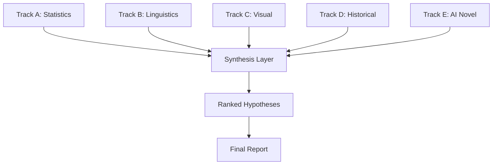

# AIDols Finale: Voynich Manuscript Challenge 🏆

> **Mission**: Leverage multi-model AI analysis to generate novel insights and get as close as possible to understanding the Voynich manuscript

## Background Context

The Voynich manuscript (~1404-1438) is a 240-page illustrated codex written in an unknown script that has resisted all decipherment attempts for centuries. Recent AI research (2024-2025) has confirmed:
- The text follows natural language patterns (Zipf's law) - **NOT** random gibberish
- May contain 2025 structural analysis shows "syntax and linguistic shifts"
- 2018 Hebrew hypothesis (Alberta University) produced nonsensical results
- **No Rosetta Stone exists** - making traditional decipherment extremely difficult

### Data Available
| File | Description | Size |
|------|-------------|------|
| [ZL3b-n.txt](file:///C:/Users/Jeffrey/.gemini/antigravity/playground/magnetic-cosmos/voynich_ZL3b.txt) | Zandbergen-Landini EVA transcription | 8511 lines |
| [RF1b-e.txt](file:///C:/Users/Jeffrey/.gemini/antigravity/playground/magnetic-cosmos/voynich_RF1b.txt) | Reference transliteration | Combined GC+ZL |
| High-res scans | Yale Beinecke Library | Available online |

---

## User Review Required

> [!IMPORTANT]
> **Challenge Scope**: This is a research/creative challenge, not a promise to "solve" the manuscript. We aim to:
> 1. Generate novel AI-driven hypotheses
> 2. Cross-reference multiple analysis tracks
> 3. Document our methodology for reproducibility
> 4. Potentially uncover patterns missed by previous researchers

---

## Proposed Analysis Framework

### Phase 1: Data Preparation
- [x] Download EVA transcription files ✅
- [ ] Parse IVTFF format into structured data
- [ ] Create word frequency analysis
- [ ] Map section types (herbal, astronomical, biological, recipes)

---

### Phase 2: Multi-Model "Mastermind Panel" Analysis

We propose 5 parallel analysis tracks, each with a distinct AI perspective:

#### Track A: Statistical Cryptanalysis 🔢
**Objective**: Deep statistical pattern analysis
- Letter/word frequency distributions
- N-gram analysis (bigrams, trigrams)
- Entropy calculations per section
- Comparison with known medieval languages
- **Key Question**: Does the text behave like an encoded natural language or a constructed system?

#### Track B: Comparative Linguistics 🗣️
**Objective**: Cross-reference with candidate languages
- Test Hebrew hypothesis with proper context
- Compare with Proto-Romance, Turkish, Nahuatl theories
- Analyze word structure (suffixes, prefixes)
- **Key Question**: What language family shows highest correlation?

#### Track C: Visual-Text Correlation 🌿
**Objective**: Match illustrations to text patterns
- Extract plant ID metadata from transcription
- Correlate botanical sections with known herbals
- Analyze if illustration complexity matches text length
- **Key Question**: Do the illustrations provide decipherment clues?

#### Track D: Historical Context Mapping 📜
**Objective**: Narrow down origin and purpose
- Radiocarbon dating context (1404-1438)
- Geographic indicators in illustrations
- Potential authorship candidates
- **Key Question**: What was the manuscript's intended function?

#### Track E: Novel AI Approaches 🤖
**Objective**: Apply modern AI techniques
- LLM-based pattern recognition
- Semantic clustering of "words"
- Attempt phonetic mapping
- **Key Question**: Can AI find patterns humans missed?

---

### Phase 3: Synthesis Protocol

**Cross-Validation Rules**:
1. Each hypothesis must be supported by ≥2 tracks
2. Contradictions are explicitly documented
3. Confidence levels assigned (High/Medium/Low/Speculative)

---

## Verification Plan

### Automated Validation
| Check | Method | Success Criteria |
|-------|--------|------------------|
| Data integrity | Hash comparison | Files match source |
| Statistical validity | Cross-check with published research | Within expected ranges |
| Pattern reproducibility | Multiple runs | Consistent results |

### Peer Review (Jury Protocol)
Following the "De Zilvervloot" methodology:
1. Present findings to critical AI panel
2. Document counterarguments
3. Iterate on weakest hypotheses

### Manual Verification
- [ ] Cross-reference findings with voynich.nu community research
- [ ] Compare statistical outputs with published papers
- [ ] User reviews final hypothesis document

---

## Expected Deliverables

1. **`voynich_analysis_report.md`** - Comprehensive findings document
2. **`voynich_statistics.json`** - Raw statistical data
3. **`hypothesis_rankings.md`** - Ranked theories with evidence
4. **`walkthrough.md`** - Documentation of methodology

---

## Timeline Estimate

| Phase | Duration | Effort |
|-------|----------|--------|
| Data Preparation | 10 min | Automated |
| Track Analysis (5x) | 30 min | AI-intensive |
| Synthesis | 15 min | Cross-reference |
| Documentation | 15 min | Report writing |
| **Total** | ~70 min | One session |

---

> [!TIP]
> **Move 37 Strategy**: Instead of traditional cryptanalysis, we focus on **pattern anomalies** - statistical outliers that might reveal hidden structure, similar to how AlphaGo found unconventional moves.
